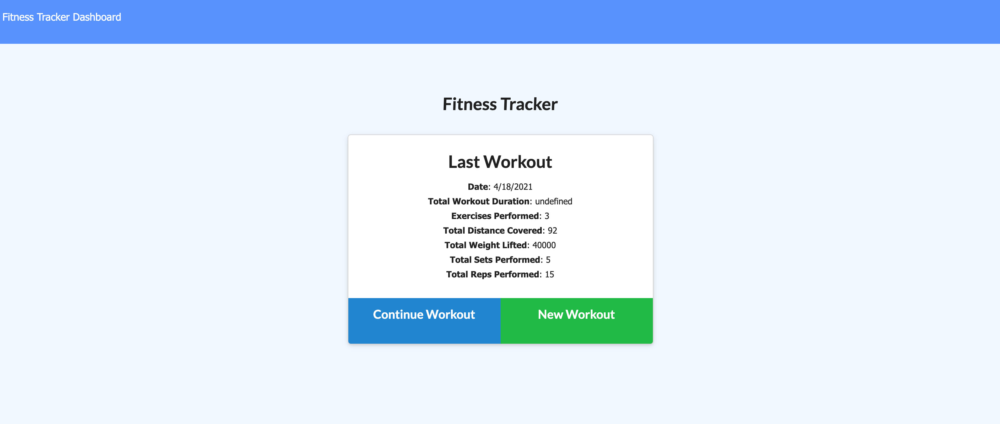

# Fitness Tracker

## Description

This application allows the user to add and keep track of her weekly workouts. The application also includes a stats dashboard with the aggregate data for easy access.

## Technologies

The application was built using several Node JS packages (Express, Mongoose, Morgan and Dotenv) and used a NoSQL database (Mongo). 

## Pages

https://whispering-cliffs-92280.herokuapp.com/ 



## Contributing

Pull requests are welcome. 

## Tests

```bash

No tests required 

```

## License

### MIT License

